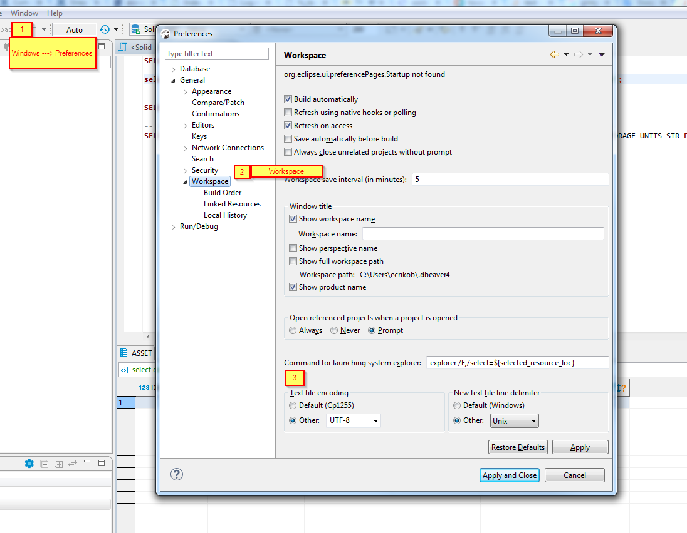

# DBeaver_Config 

<!-- MarkdownTOC autolink="true" -->

- [Сменить кодировку на UTF-8](#%D0%A1%D0%BC%D0%B5%D0%BD%D0%B8%D1%82%D1%8C-%D0%BA%D0%BE%D0%B4%D0%B8%D1%80%D0%BE%D0%B2%D0%BA%D1%83-%D0%BD%D0%B0-utf-8)
- [Ошибкас биндингом параметра `?`](#%D0%9E%D1%88%D0%B8%D0%B1%D0%BA%D0%B0%D1%81-%D0%B1%D0%B8%D0%BD%D0%B4%D0%B8%D0%BD%D0%B3%D0%BE%D0%BC-%D0%BF%D0%B0%D1%80%D0%B0%D0%BC%D0%B5%D1%82%D1%80%D0%B0-)
- [Включить вставку в UPPER CASE](#%D0%92%D0%BA%D0%BB%D1%8E%D1%87%D0%B8%D1%82%D1%8C-%D0%B2%D1%81%D1%82%D0%B0%D0%B2%D0%BA%D1%83-%D0%B2-upper-case)
- [Вместо TAB - 4 Пробела](#%D0%92%D0%BC%D0%B5%D1%81%D1%82%D0%BE-tab---4-%D0%9F%D1%80%D0%BE%D0%B1%D0%B5%D0%BB%D0%B0)
- [Выполнение запросов при начальной установки соединения \(Установить переменные при запуске DBeaver\)](#%D0%92%D1%8B%D0%BF%D0%BE%D0%BB%D0%BD%D0%B5%D0%BD%D0%B8%D0%B5-%D0%B7%D0%B0%D0%BF%D1%80%D0%BE%D1%81%D0%BE%D0%B2-%D0%BF%D1%80%D0%B8-%D0%BD%D0%B0%D1%87%D0%B0%D0%BB%D1%8C%D0%BD%D0%BE%D0%B9-%D1%83%D1%81%D1%82%D0%B0%D0%BD%D0%BE%D0%B2%D0%BA%D0%B8-%D1%81%D0%BE%D0%B5%D0%B4%D0%B8%D0%BD%D0%B5%D0%BD%D0%B8%D1%8F-%D0%A3%D1%81%D1%82%D0%B0%D0%BD%D0%BE%D0%B2%D0%B8%D1%82%D1%8C-%D0%BF%D0%B5%D1%80%D0%B5%D0%BC%D0%B5%D0%BD%D0%BD%D1%8B%D0%B5-%D0%BF%D1%80%D0%B8-%D0%B7%D0%B0%D0%BF%D1%83%D1%81%D0%BA%D0%B5-dbeaver)
- [Поддержка pl/pg SQL скриптов](#%D0%9F%D0%BE%D0%B4%D0%B4%D0%B5%D1%80%D0%B6%D0%BA%D0%B0-plpg-sql-%D1%81%D0%BA%D1%80%D0%B8%D0%BF%D1%82%D0%BE%D0%B2)
- [Показывать номера строк](#%D0%9F%D0%BE%D0%BA%D0%B0%D0%B7%D1%8B%D0%B2%D0%B0%D1%82%D1%8C-%D0%BD%D0%BE%D0%BC%D0%B5%D1%80%D0%B0-%D1%81%D1%82%D1%80%D0%BE%D0%BA)

<!-- /MarkdownTOC -->

## Сменить кодировку на UTF-8

> Сменить кодировку удобно для того чтобы потом 

## Ошибкас биндингом параметра `?`

> Можно изменить значение анонимного параметра с '?', например, на '#'

## Включить вставку в UPPER CASE 

## Вместо TAB - 4 Пробела

## Выполнение запросов при начальной установки соединения (Установить переменные при запуске DBeaver)

## Поддержка pl/pg SQL скриптов

## Показывать номера строк

