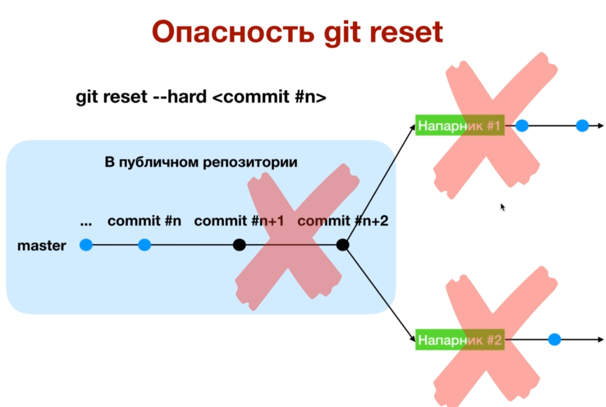

# Настройка Git

GIT - распределенная система контроля версий

## Первоначальная настройка Git

$`git config --global user.name "Имя Фамилия"`
$`git config --global user.email puskin@gmail.com`

Меняет цветовую схему на более читаемую
$`git config --global color.ui true`

## Ошибка при которой прокручивается на черный экран

Options -> Window -> Rows присвоить 32, вместо 24, который епо умолчанию

## Команды

Показать список настроек: 

$`git config --list --show-origin`

## Генерация ssh ключей 

```bash
# ключ SSH с шифрованием RSA и 4096
ssh-keygen -t rsa -b 4096 -C "ваша@почта.com"

eval `ssh-agent -s`

`ssh-add ~/.ssh/id_rsa`

cat ~/.ssh/id_rsa.pub
```

## ssh агент

Запуск в фоновом режиме  
`eval "$(ssh-agent -s)"`

Добавить ключ и указать пароль  
`ssh-add ~/.ssh/id_rsa`

[Подробнее об ssh-agent](https://kamarada.github.io/en/2019/07/14/using-git-with-ssh-keys/#.X-DHNNgzY2w)
[Менее подробно, но на русском](https://only-to-top.ru/blog/tools/2019-12-08-git-ssh-windows.html)

## Сценариb взаимодействия

### Стандартный

```bash
git add . # Добавить все неотслеживаемые файлы под контроль гита
git commit -m "comment" # Закоммитить изменения
git push # Загрузить все коммиты в удаленный репозиторий
```

## добавьте gitignore- и gitattributes-файлы

# Как работает Git

Гит хранит изменения файлов целиком - каждый раз копирую измененные файлы при коммите и сохраняя их в **снимок проекта**.

Если файл не поменялся, то git не будет копировать его в новый снимок

## Базовая работа с git

### Основные команды

Команда                              | Описание                                   
-------------------------------------|--------------------------------------------
git status                           | Получить текущий статус проекта
git add                              | Добавить файлы в следующий снимок проекта
git commit -m "Комментарий к снимку" | Сделать снимок проекта - коммит
git log [-n]                         | Посмотреть историю коммитов, n - количество отображаемых коммитов
git init                             | Создание git проета 

### git add

> Добавить файлы в следующий снимок проекта

Команда                   | Описание | Пример
--------------------------|----------------------------------------------------
git add <список файлов>   | Добавить файлы с именами file1 и file2 | git addd file1 file2
git add .                 | Добавить файлы в текущей директории и всех поддиректориях в этой папке | 
git add *.java            | Добавить все файлы с расширением java | 
git add dir/              | Добавить все файлы из директории dir
git add "*.java"          | Добавить все файлы в проекте с расширением .java

### git status

> Узнать статус файлов

Статус EN | Статус RU       | Действие
----------|-----------------|------------------
untracked | неотслеживаемый | Создан новый файл
modified  | измененный      | Файл изменен
staged    | подготовленный  | `git add` - добавить файлы в следующий снимок проекта - сделать файл **отслеживаемым**
committed | зафиксированный | `git commit` - сделать снимок проекта

### git diff

> Показывает разницу между текущим **неотслеживаемым** (по умолчанию) состоянием репозитория и последним снимком репозитория
>
> dif - difference (разница)

git diff - работает со строками
При изменение строки - будет описано что старая строка была удалена, а новая вставлена

Пример                       | Описание
-----------------------------|-----------------------------------------
git diff                     | Показывает разницу между **только измененными файлами** и последним коммитом (для неотслеживаемых **новых** фалов команда не работает)
git diff --staged            | Показывает разницу между текущим **отслеживаемыми (после команды add) новыми или модифицированными файлами** и последним коммитом
git diff COMMIT_HASH_CODE    | Показывает разницу между текущим **состоянием репозитория** и указанным снимком репозитория (достаточно 4 первых символа hash кода) (кроме новых неотслеживаемых файлов)

### git reset

Отмена изменений в проекте и отката до определенного снимка проекта

`HEAD` - указатель на последний снимок проекта

HEAD -> master - указатель указывает на самый последний коммит в ветке мастер

`git reset HEAD^` - сместить на прошлый коммит
`git reset HEAD^^^` <=> `git reset HEAD~3` - откат на три коммита назад

**Синтаксис команды**  
$`git reset [--soft|--mixed|--hard][commit]`

[commit]:
1. `HEAD^, HEAD^^, HEAD^^^, ...` 
2. `HEAD~1, HEAD~2, HEAD~3, ...`
3. <commit_hash_code>

Режим    | Обозначение            | Описание                                                                 | Пример 
---------|------------------------|--------------------------------------------------------------------------|-----------------------
--soft   | Мягкий                 | Все коммиты после указанного переводятся в stage (отслеживаемую зону)    | git reset --soft HEAD^^
--mixed  | (По умолчанию)         | Все коммиты после указанного переводятся в unstage (неотслеживаемую зону)| git reset --mixed HEAD^^ <=> git reset HEAD^^
--hard   | Удаляются изменения    | Безвозвратно удаляет коммиты после указанного                            | git reset --hard HEAD^^

**Примеры**

Команда                | Краткая команда    | Описание
-----------------------|--------------------|--------------------------------------------------
git reset --soft HEAD  | get reset --soft   | Ничего не делает
git reset --mixed HEAD | git reset          | Перевести изменения из stage в unstage
git reset --hard HEAD  | git reset --hard   | Безвозвратно удаляет изменения, сделанные после последнего коммита (не удаляет Untracked files)

Если опубликовали коммит в публичный репозиторий - не стоит делать reset по удалению коммитов, так как это приведет к потере изменений у других программистов на проекте.

На скриншоте - Наппарник #1, Напарник #2 не смогу запушить свои локальные изменения, так как произойдет десинхронизация истории в git.



### git checkout

Перемещение между:
  
1. Коммитами

	$`git checkout <commit_hach_code | HEAD^^ | HEAD~2>`
	
	Проект вернется к состоянию на заданный снимок проекта, чтобы переместиться обратно `git checkout master`

	DETACHED - указатель отделенный от актуальной версии проекта, **любые изменения и коммиты в этом состояние удаляются сборщиком мусора** при переходе к другому коммиту

2. Версиями отдельных файлов

	$`git checkout <commit_hach_code | HEAD^^ | HEAD~2> -- путь_до_файла_1 путь_до_файла_2`


	$`git checkout HEAD^^ -- dir1/file1 file2`

	Вернет файлы file1 и file2 к версии, которая была в коммитах в прошлом

	$`git checkout -- file2`

	


3. Ветками
	
	


